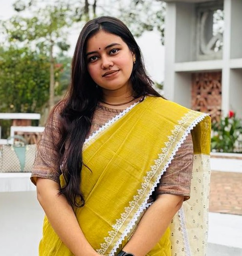

---

###  About Me
I am a driven and curious last semester Computer Science student at **Leading University**. I have a deep passion for technology and innovation, specifically focusing on how logic can solve complex challenges. My ambition is to contribute meaningfully to a dynamic professional environment where I can expand my skills in Machine Learning and software development.

I am actively involved in the academic community, participating in research bootcamps and technical seminars to stay at the forefront of emerging technologies.

---

###  Technical Toolbox
*   **Programming:** C, C++, Python (Special focus on Machine Learning)
*   **Web Development:** HTML, CSS, JavaScript, Bootstrap
*   **Specialized Tools:** GitHub, Visual Studio Code, PyCharm, CodeBlocks
*   **Soft Skills:** Leadership, Public Speaking, Event Management, and Technical Moderation

---

###  Academic Background
*   **B.Sc. in Computer Science & Engineering** | Leading University, Sylhet 
    *   **CGPA: 3.80 / 4.00** (Current)
*   **Higher Secondary Certificate** | M.C. College, Sylhet
*   **Secondary School Certificate** | Gowainghat Model High School

---

###  Organizational Leadership
*   **Publications & Newsletter Coordinator:** IEEE Computer Society LU SB Chapter (2025–Present)
*   **Executive Member:** Leading University Social Services Club (2024–Present)
*   **Host:** "Bootcamp on Research Practices in Machine Learning" & 2nd Student Research Conference (LURS)
*   **Volunteer:** IEEE Day (2024, 2025) and "Binary Hunting" Programming Contest

---

### Achievements
* **Volunteer Appreciation Certificate:** IEEE Computer Society LU SB Chapter
* **LUMUNA:** Executive Member of the Steering Committee (2023–2024)
* **LURS Appreciation:** Recognized for coordination and hosting at the 2nd Student Research Conference

---

###  Let's Connect!
*   **Email:** [suchitrachoitiofficial@gmail.com](mailto:suchitrachoitiofficial@gmail.com)
*   **Phone:** +8801609534251
*   **Interests:** Bengali Literature, Technical Writing, and Traveling
